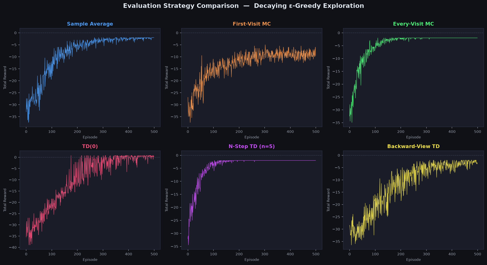

# RL Fundamentals

Self-contained, from-scratch implementations of classic reinforcement
learning algorithms, done to build up the fundamentals before applying them
to the full 500 card game project. Each script is independent and only
depends on `numpy`/`matplotlib`/`plotly`.

- **`MultiArmedBandit.py`** — a stationary multi-armed bandit and a set of
  exploration strategies compared against it: pure exploitation/exploration,
  epsilon-greedy and decaying epsilon-greedy, optimistic initialization,
  softmax action selection, upper confidence bound (UCB), and Thompson
  sampling.
- **`FrozenLakeRL.py`** — a custom FrozenLake-style MDP (defined explicitly
  as transition probabilities) solved with dynamic programming: policy
  evaluation, policy improvement, and value iteration.
- **`CliffMaze.py`** — a custom 10x10 cliff-walking/maze environment (walls
  and holes) used to compare value-estimation methods under a decaying
  epsilon-greedy policy: sample-average, first-visit and every-visit Monte
  Carlo, TD(0), n-step TD, and backward-view TD(λ). Running it reproduces
  `rl_results.png`:

  

## Running

```bash
python MultiArmedBandit.py
python FrozenLakeRL.py
python CliffMaze.py
```

`CliffMaze.py` saves its comparison plot to `rl_results.png` in the current
working directory.
